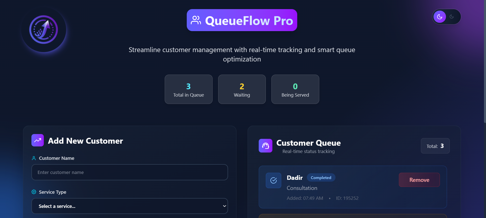
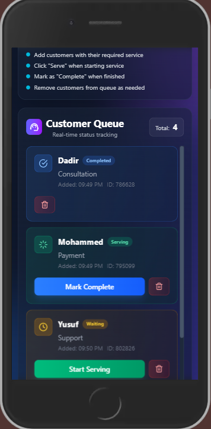

# QueueFlow Pro

A modern, frontend-first queue management application built with **React + Vite** and styled with **Tailwind CSS**.

QueueFlow Pro helps teams track customer flow in real time with a clean, dashboard-like interface for adding customers, updating service status, and monitoring queue health.

---

## ✨ Features

- **Live queue tracking** with status transitions:
  - `waiting` → `serving` → `completed`
- **Quick customer intake** form with service selection
- **Operational stats cards** (total, waiting, serving)
- **Instant actions**:
  - Start serving
  - Mark complete
  - Remove customer
- **Branded UI update** with an integrated QueueFlow Pro logo
- **Dark mode** support with seamless theme switching
- **Persistence** of queue state and theme preference using `localStorage`
- **Enhanced responsive experience** for mobile, tablet, and desktop screens

---

## 📱 Responsive Design

- Mobile-first spacing and typography adjustments across forms, cards, and queue items
- Smooth layout scaling through `md` and `lg` breakpoints (single-column to two-column dashboard)
- Adaptive action controls in queue cards (compact icon actions on smaller screens, full text actions on larger screens)
- Improved header/stat card wrapping for better usability on narrow and medium-width devices

---

## 🧱 Tech Stack

- **React 19**
- **Vite 7**
- **Tailwind CSS 4**
- **React Icons**
- **ESLint 9**

---

## 🌐 Live Demo

Live URL: https://queue-management-five.vercel.app/

---

## 📦 Repository

- **GitHub**: [`https://github.com/Dadir-Dev/queue-management`](https://github.com/Dadir-Dev/queue-management)

---

## 🖼️ Visuals

### Logo

<div>
  

</div>

### App Screenshots

<div style="display:flex;gap:1rem;align-items:center;justify-content:center;flex-wrap:wrap;">
  
  
</div>

---

## 🚀 Getting Started

### Prerequisites

- **Node.js** 18+ (recommended)
- **npm** 9+

### Installation

```bash
npm install
```

### Run in Development

```bash
npm run dev
```

Open the local URL shown in your terminal (typically `http://localhost:5173`).

### Build for Production

```bash
npm run build
```

### Preview Production Build

```bash
npm run preview
```

### Lint

```bash
npm run lint
```

---

## 📁 Project Structure

```text
.
├── public/
│   ├── images/
│   │   └── socials/
│   │       ├── github-color-svgrepo-com.svg
│   │       ├── linkedin-svgrepo-com.svg
│   │       └── x.svg
│   └── vite.svg
├── src/
│   ├── assets/
│   │   ├── logo.png
│   │   ├── Desktop_View_2026_04_21.png
│   │   └── Mobile_View_2026-04-24.png
│   ├── components/
│   │   ├── CircularLogo.jsx      # Reusable animated brand logo
│   │   ├── Header.jsx            # Header + queue stats + theme toggle
│   │   ├── QueueForm.jsx         # Customer intake form
│   │   ├── QueueDisplay.jsx      # Queue list + status/action controls
│   │   └── Footer.jsx
│   ├── context/
│   │   ├── ThemeContext.jsx      # Theme provider + persistence
│   │   ├── themeContext.js       # Theme context definition
│   │   └── useTheme.js           # Custom theme hook
│   ├── App.jsx                   # Main app state and layout orchestration
│   ├── App.css
│   ├── index.css
│   └── main.jsx
├── index.html
├── package.json
├── tailwind.config.js
└── vite.config.js
```

---

## 🧩 Component Architecture

- `App.jsx` manages queue state, localStorage persistence, and top-level layout composition.
- UI responsibilities are split into focused components (`Header`, `QueueForm`, `QueueDisplay`, `Footer`, and `CircularLogo`).
- Theme behavior is centralized through context (`ThemeContext.jsx`, `themeContext.js`) and consumed via the reusable `useTheme` hook.

---

## 🔄 Queue Workflow

1. Add a customer and choose a service.
2. Customer enters the queue with `waiting` status.
3. Move to `serving` when service starts.
4. Mark as `completed` when done.
5. Remove entries from the list when no longer needed.

---

## 🛠️ Available Scripts

| Script            | Description                      |
| ----------------- | -------------------------------- |
| `npm run dev`     | Start local development server   |
| `npm run build`   | Create production build          |
| `npm run preview` | Preview production build locally |
| `npm run lint`    | Run ESLint checks                |

---

## 📌 Current Scope

This project is currently a **client-side application** (no backend persistence).

Potential next steps:

- Add API + database persistence
- Add authentication/roles (admin, staff)
- Add estimated wait times and analytics
- Add tests (unit + integration + E2E)

---

## 🤝 Contributing

Contributions are welcome.

If you plan to contribute:

1. Fork the repository
2. Create a feature branch
3. Commit your changes
4. Open a pull request with a clear summary and screenshots (for UI changes)

---

## 🙏 Acknowledgements

- **React**, **Vite**, **Tailwind CSS**, and **React Icons** for the amazing tooling ecosystem.
- The broader **React community** and documentation for best practices and inspiration.
- Created as part of a **frontend learning journey** focused on modern React and UI design.

---

## 👨‍💻 Author

**Abdikadir Mohammed(Dadir Dev)**

<p align="left">
<a href="https://github.com/Dadir-Dev" target="_blank" rel="noopener noreferrer">
   
</a>
<a href="https://www.linkedin.com/in/abdikadir-mohammed-54717318b/" target="_blank" rel="noopener noreferrer">
   
</a>
<a href="https://x.com/Dadir_Dev" target="_blank" rel="noopener noreferrer">
   
</a>
</p>

## 📜 License

This project is open source and available under the [MIT License](LICENSE).
